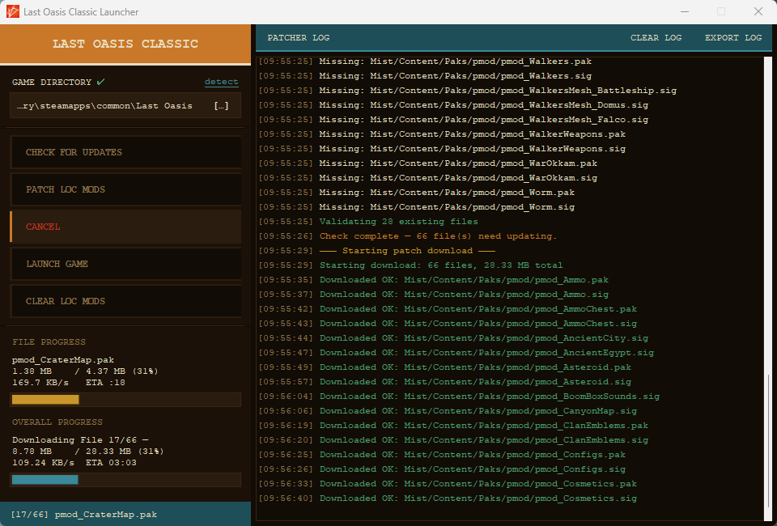
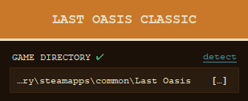

# Last Oasis - Classic Patcher

LOCPatcher is the launcher and patcher for the community built modified version of Last Oasis built on the Season 4 game branch.

The patcher makes versioning of user clients via .pak files more reliable and minimizes required technical knowledge to 
play Last Oasis Classic.

## Requirements

`Python 3.10+` is required to work on this project

``platformdirs`` is required to support local files across different operating systems `pip install platformdirs`

## Quickstart

Clone the repo & `pip install platformdirs`

Run `python main.py` to open the patcher

**Recommended** - swap the GAME DIRECTORY out of your Python environment, even if it's only to a temporary folder

## Building the exe

`pyinstaller` is required to build the launcher into a distributable .exe with the build script `pip install pyinstaller`

## Core Functions

### Checking for updates

The patcher requests a patch list from a remote url, compares the patch manifest to the local installation, and 
determines which files need to be modified

### Patching pak files

The patcher downloads up-to-date versions of any missing or out-of-date local files from the remote host in a binary 
stream with incremental writes

(*Note : compression serves no benefit here, .pak files are minified and must be served as they are.*)

Files in the process of being downloaded are stored as temp files and when the download is complete they are renamed 
into place and validated

### Launching the game

Launching Last Oasis Classic requires the -noeac flag so the `LAUNCH GAME` button on the patcher bypasses requiring 
users to pass this flag manually via a .bat file, using psh, etc

### Clearing mods

Due to the nature of modifying Last Oasis Classic using .pak files the mods *cannot* be uninstalled by validating game 
files

When Steam validates a game install it checks known game files but .paks are all additional files, not modifications 
made directly to the files Steam knows and will check

This gap in what Steam can 'see' means that modded .pak files will persist and load even if files are validated meaning 
Steam is only capable of deleting the modded .pak files with a full uninstallation

Clearing mods uses a locally persisted list of files made up of all unique files the patcher has received from the
remote patch list since the last time mods were cleared

The patcher will attempt to delete all files it may have ever written to the disk and in this way uninstall the mods, no
clean game install from Steam required

## Additional Features

### Installation Detection (Windows Only)

The patcher has the ability to search for a valid Last Oasis game installation on Windows using registry keys

The GAME DIRECTORY can also be set manually if the automatic detection fails or a user isn't on Windows

### User Configurable Settings

The patcher relies on a few persisted values that can be found in `"AppData\Local\LastOasisClassic\LOCPatcher\loc_patcher.ini"`

The **[patcher]** section of `loc_patcher.ini` contains values users may need to configure depending on their operating system

`working_dir` is the base path that modified files will be written to, it should be the location of your Last Oasis install 
(Steam -> Library -> `right click` Last Oasis Classic -> Properties... -> Installed Files -> Browse... -> Copy Address as Text)

`bin_dir` is the path from `working_dir` to the `.exe` used to launch Last Oasis Classic (Mist -> Binaries -> Win64 by default on Windows)
 for other platforms check **Mist -> Binaries** and attempt to find a `.exe` in a **subfolder of Binaries**

`exe_name` is the name of the actual shipped `.exe` file that can be used to launch the game with arguments 
(required to turn off eac file validation which enables .pak modification) Windows default is `MistClient-Win64-Shipping.exe` 

The **[patch_cache]** section is used to track all the files that Last Oasis Classic has modified. Since the patch list 
can change and leave orphaned files a backup is necessary to ensure clean uninstallation

**Verifying integrity of game files through steam alone cannot uninstall Last Oasis Classic**

### Logging

The patcher has a logger to inform users of what the patcher is doing and what, if anything, goes wrong during the patching process

Patcher logs are stored in a folder `patcher_logs` wherever the patcher itself is running from

Ex. if you run it from your desktop it will attempt to create a folder there for logs

The patcher also has a button `EXPORT LOG` to specifically extract the logs from the current patching session to a separate file, useful for helping users debug

## Structure

### `app.py`

Handles creating and updating the UI including binding actions to buttons

### `core.py`

Handles the core patching logic including getting the patch manifest, checking files, downloading files (patching), and
deleting mod files when the mods are cleared

### `config.py` & `constants.py`

Handles settings that may be changed independently of main application logic, separated into `config.py` for settings 
users should be able to modify and `constants.py` for settings that developers might want to adjust

### `network.py`

Creates a shared SSL context and configures connection settings (user agent) the patcher uses

### `utils.py`

Helper methods that break logic out of parent files or methods

### `logging`

`logger.py` creates the logger instance for the patcher so there's a record of actions taken by the patcher for users 
to review or forward for debugging

`log_handler.py` forwards log lines to the patcher log window to provide user updates with less code duplication.
This also scopes logs relevant to debugging a particular session with the `EXPORT LOG` button

## Known Edges

### This patcher is no longer being used (the project was adopted by the game developer & team members hired on)

That being said, if anyone wants to adapt this patcher to another project here are considerations to be made

### Pak versioning

On some platforms `.pak` files modify at runtime which causes some users to repeatedly have to download files. Depending 
on the number of files impacted this can range from an annoying 2-minute patch every time the game is opened to
a severe problem that requires gigs of patches because the validation is limited to file hash matching. To fix this a
separate version number could be included in the patch manifest and persisted in the `.ini` after the crc check confirms 
there was no corruption in transit.

### Remote patch limitations

There were very few orphaned `.pak` files over the lifetime of Last Oasis Classic but in the instances that .pak files 
were abandoned it was simply bloat that silently stopped being used. In a worst case scenario `.pak` files could conflict 
and so implementing the ability for the patch manifest to specify .pak files that should be deleted would be wise.

### Single download worker

Since our update host was a dedicated server with limited bandwidth a single worker was chosen over multiple workers 
because server bandwidth was always the most likely bottleneck. If you use a more capable hosting service you would 
greatly benefit from further parallelizing patches with multiple workers

### SSL Implementation

This project doesn't fully implement SSL to secure the download pipeline at the moment in a longer lived project this
would have been a priority
